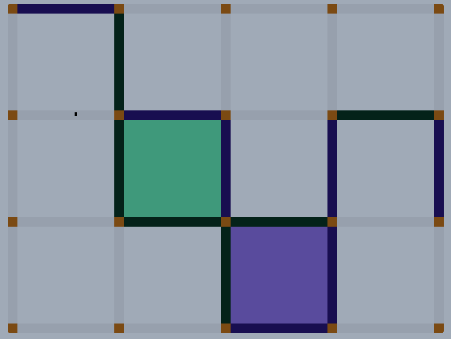

# Dots and Boxes and Synthesizers
####

### Language Used
HTML, CSS, Javascript, Garageband

## Getting Started
[PLAY THE GAME](https://daleinen7.github.io/dots-and-boxes/)

The basic rules of Dots and Boxes are players take turns connecting lines on a grid of dots. If a player connects a box they get a point and can make an additional move. When there are no more lines to draw, the points are added up and the player with the most completed boxes wins.

This version has a twist.

## Chords
In this version, each player is assigned a chord. Player one plays C major. Player two is stuck with the far less popular Bb sus4.

Each line added to a box adds a note from each players chord until a blend of the two chords (or if a player is fortunate enough to draw all 4 lines of a box their full chord) plays.

The winner gets to hear their boxes played into a unique composition for each game.  

## Composition

Score theory and composition by [.::.](https://o88o.bandcamp.com/)

## Next Steps
1. Given time and energy I'd like to make each note glow as it's played. (Or a better artistic direction in general, contact me if you'd like to contribute visually)
2. A responsive layout would be nice.
3. ~~Handling a tie (maybe play every square?)~~
4. Make an odd number of boxes to avoid tie

## Notes from the music director
I think the lines need to be colored separately so that if a box has 3 walls you can tell how many are yours. If a player were to focus on completing their chord, this would be necessary. 

I also think there should be an incentive for completing an entire box with your full chord. Maybe gives an option to remove one line from a non complete box, changing the flow of turns that can make boxes and dots predictable. Could actually be a more strategic, back stabby game. 

Easy thing, I think the grid needs to have an odd number of rows and columns, yielding an odd number of total squares to ensure it can't end in a tie. 

Lastly, once the game concept is fully conceived, I'd like to see a really detailed and artistic rebuild that focuses heavily on the looks, sounds and playing experience so that every touch felt as gratifying as possible. 

If you wanted to really go after this, I'd be happy to brainstorm more. To make a real game, you'd prob need an AI opponent option, and a rewarding concept for advancement (different chords and tones is my first thought).

